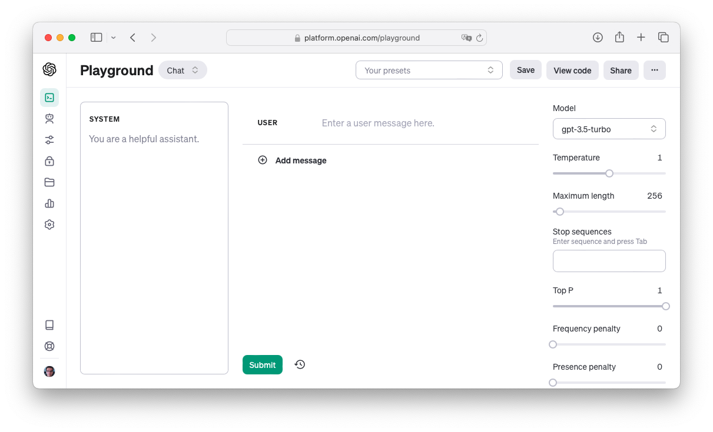
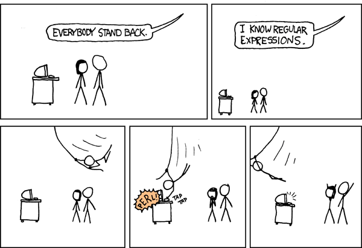

::: {.cell}
<style type="text/css">
.reveal h1 {
color:#0766AD;
}
mark{
background-color:#C5E898;
}
</style>
:::


# Resumen 

- Pasos para crear una cuenta de desarrollador en openAI
- Exactamente que es un API?🤔
- Realizar consultas desde R usando el paquete httr2

## Nuestra cuenta de openAI

- Iniciar sesión (mismo usuario y clave que para usar chatgpt en el navegador)

- Hacer un pago de $10 USD

- Verificar los modelos que tenemos disponibles

## Openai playground 👩🏽‍💻

Un lugar para experimentar con los diferentes modelos de [openAI](https://platform.openai.com/playground)

<center>
{width=80%}
</center>

## Tareas comunes que podermos resolver 💡

- regex: limpiar textos
- xpath: buscar en páginas web
- análisis de lenguaje natural

## Limpieza de textos con regex

**regex** = expresiones regulares


::: {.cell}

```{.r .cell-code}
library(stringr)

texto <- c(
  "escribeme a juan@hotmail.com",
  "info porfa marta@correo.es",
  "info"
)

str_extract_all(
  string = texto,
  pattern = "\\b[A-Za-z0-9._%+-]+@[A-Za-z0-9.-]+\\.[A-Z|a-z]{2,}\\b")
```

::: {.cell-output .cell-output-stdout}
```
[[1]]
[1] "juan@hotmail.com"

[[2]]
[1] "marta@correo.es"

[[3]]
character(0)
```
:::
:::


## De donde sale:  <mark>"\\b[A-Za-z0-9._%+-]+@[A-Za-z0-9.-]+\\.[A-Z|a-z]{2,}\\b"</mark>




## Nuestra primera prueba desde el playground 👩🏽‍🔬

## <mark>Xpath</mark> una forma de buscar datos en la web 🗺️

---

Precio de la [leche 2% 1L](https://express.dospinos.com/leche-homogenizada-2-l-tb-15000194)


::: {.cell}

```{.r .cell-code}
library(rvest)

url <- "https://express.dospinos.com/leche-homogenizada-2-l-tb-15000194"
pagina <- read_html(url)
  
pagina |> 
  html_element(
    xpath = "//span[contains(text(), '₡')]" 
  ) |> 
  html_text2()
```

::: {.cell-output .cell-output-stdout}
```
[1] "₡1.200"
```
:::
:::


## De dónde sale <mark>"//span[contains(text(), '₡')]"</mark>

## Ahora migremos esto a R

- Obtener nuestro [token](https://platform.openai.com/api-keys) 
- Configurar RStudio (.Renviron)
- Hacer consultas al API con el paquete [httr2](https://httr2.r-lib.org)


## Automatizar la ejecución de nuestro código

- local: cronR/taskscheduleR
- servidor:Posit Connect

---

Aprende más sobre R en el curso [Tidyverse y SQL para ciencia de datos](https://www.aprendetidyverse.com/tidyverse-y-sql-para-ciencia-de-datos) <mark>50% de descuento</mark> hasta el 15 de diciembre, <mark>inicio de clase 15 de enero 2024</mark>.

